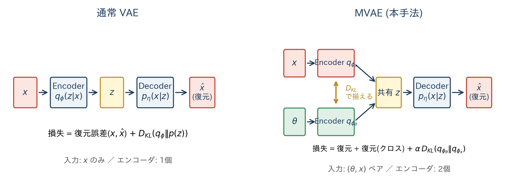

<!-- _class: title -->

# 潜在空間ベイズ推論 + MVAE + SMC のライブラリ実装

## — 観測振動データに基づく建物FEモデル更新を題材として —

 

Yaoyama et al. (2026, NED) のフレームワーク実装と推論基盤の整備

  

**発表者**: （名前）
**所属**: （所属）
**日付**: 2026-XX-XX

---

# 研究背景 — ベイズ推定で何ができるか

- 建物の **地震応答予測** には高精度なFEモデルが前提
- しかし **設計時FEM ≠ 実建物**（経年劣化、施工誤差、非構造部材 …）
- 観測振動データ $x_\mathrm{obs}$ から、剛性パラメータ $\theta$ を **ベイズ更新**したい

**ベイズの定理**:

$$
p(\theta \mid x_\mathrm{obs}) \;\propto\; \underbrace{L(\theta;\, x_\mathrm{obs})}_{\text{尤度}} \; \cdot \; \underbrace{p(\theta)}_{\text{事前}}
$$

→ **尤度 $L$ が評価できれば、事後分布が（MCMC等で）推定可能**

しかし、本問題では尤度 $L$ の評価そのものが難しい — これが課題（次スライド）

<!--
SPEAKER: 50秒。ベイズの式を中心に置いて「尤度さえあれば事後が出る」とまず言い切る。式が課題の入口になる。
-->

---

# 目的と課題

**目的**: 観測FRF $x_\mathrm{obs}$ から、剛性パラメータ $\theta$ の **事後分布** $p(\theta \mid x_\mathrm{obs})$ を効率的に推定する

**ベンチマーク（後述）**: 論文と同一の 4自由度せん断建物モデル — 真値 $\theta = (1,1,1,1)$ を屋上FRF から回収できるか

**3つの課題**:

|     | 課題                     | 内容                                                                   |
| --- | ------------------------ | ---------------------------------------------------------------------- |
| ①   | **高次元観測**           | FRF は 1024 点 → 尤度 $p(x_\mathrm{obs}\mid\theta)$ の直接定義が難しい |
| ②   | **シミュレータ高コスト** | 通常MCMCは数十万回FE解析を呼ぶ → 非現実的                              |
| ③   | **多峰性**               | 同じ屋根応答を再現する $\theta$ が複数存在（等価解）                   |

<!--
SPEAKER: 25秒。ベンチマークの存在を一言ふれておくと、後で唐突感が消える。
-->

---

# 提案手法 — 全体像

**オフライン**: MVAE が尤度を低次元の $\hat{L}$ に置き換える（ML担当）／ **オンライン**: SMC が $\hat{L}$ のみで事後を推定（FE 不要）

<!--
SPEAKER: 30秒。「機械学習はオフラインで尤度を作る部分。推論はSMC」と分けて伝える。FEを呼ばないという点を強調。
-->

---

# Step 2: MVAE — 通常 VAE との比較

- VAE: 入力 $x$ のみ・エンコーダ1個 / MVAE: $(\theta, x)$ ペア・エンコーダ2個・**KL で揃える**
- 学習後、$\theta$ と $x_\mathrm{obs}$ を **同じ潜在空間で比較可能** に

<!--
SPEAKER: 40秒。図の左右を順に指す。「入力」「エンコーダ数」「損失のKL項の中身」が違うと伝える。
-->

---

# Step 3a: 潜在空間ベース尤度 — 式変形

真の尤度（直接評価困難）:

$$L(\theta;\, x_\mathrm{obs}) = \int p(x_\mathrm{obs}\mid z)\, p(z\mid \theta)\, dz$$

MVAE 近似（2エンコーダ + 潜在事前 $p(z)$）:

$$\hat{L}(\theta;\, x_\mathrm{obs}) = \int \frac{q_{\phi_x}(z\mid x_\mathrm{obs})\, q_{\phi_\theta}(z\mid \theta)}{p(z)}\, dz$$

すべて **ガウス** → **完全平方完成で閉形式**
→ **エンコーダ通過のみで尤度評価**、FE 解析不要

<!--
SPEAKER: 35秒。式変形3段。右の図で「2つのガウスの重なり=尤度」を視覚的に。
-->

---

# Step 3b: SMC — 焼きなまし + 重み + MCMC

**焼きなまし**: $\beta_t \in [0,1]$ を段階的に上げ、中間分布を経由

$$
p_t(\theta) = c^{-1}\, \hat{L}(\theta;\,x_\mathrm{obs})^{\beta_t - \beta_{t-1}}\, p_{t-1}(\theta), \quad
w^{(n)}_t(\beta) = \hat{L}\bigl(\theta_{t-1}^{(n)};\,x_\mathrm{obs}\bigr)^{\beta-\beta_{t-1}}
$$

→ 次の温度 $\beta_t$ は ESS が $\gamma N$ を保つよう **二分探索**、リサンプリング

**MCMC ムーブ**: ガウス遷移カーネル $K(\theta, \cdot) = \mathcal{N}\!\left(\cdot \mid \theta,\, \Sigma_t\right)$、共分散は Ching & Chen (2007)

$$
\Sigma_t = \frac{b^2}{S_t}\sum_{n} w_t^{(n)}(\theta_t^{(n)}-\bar\theta_t)(\theta_t^{(n)}-\bar\theta_t)^\top, \qquad \eta = \min\!\left\{1,\; \frac{p_t(\theta^*)}{p_t(\theta)}\right\}
$$

粒子は独立に進化 → **GPU で自然に並列化**、焼きなましで **多峰性に強い**

<!--
SPEAKER: 35秒。焼きなまし+重み・遷移カーネル+共分散・採択 の3塊で説明。
-->

---

# ベンチマーク — 4自由度せん断建物

**条件設定** (論文と同一):

- せん断型 4 自由度モデル: **各層は水平 1 方向のみに変位**（質点ばねダンパ）
- 各層質量は等しく $m$、剛性 $k_i = \theta_i k$ （$\theta_i \in [0.33, 3.00]$）
- 減衰: Rayleigh（1 Hz と 30 Hz で減衰比 0.02）
- 観測: **基部加振 + 屋上 FRF のみ**、1024 点、ノイズ付加
- 真値: $\theta = (1,1,1,1)$、事前分布は一様 $\mathcal{U}([0.33, 3.00])$

**運動方程式**:

$$
M \ddot{\mathbf{u}} \;+\; C(\theta) \dot{\mathbf{u}} \;+\; K(\theta)\, \mathbf{u} \;=\; -M\,\boldsymbol{\iota}\, \ddot{u}_g
\qquad (\mathbf{u}\in\mathbb{R}^4: \text{各層の水平変位})
$$

→ 周波数領域に持ち込み、屋上絶対加速度の $\log|H(f)|$ を観測量とする

<!--
SPEAKER: 25秒。質量等しい / Rayleigh減衰 / 屋上FRFのみ、と条件を3点で言い切る。
-->

---

# 結果 — 事後分布と計算速度

事後分布:
- 真値 $(1,1,1,1)$ にメインモード集中
- 等価解 A/B/C も別モード再現

計算速度 (論文 表2):

|                          | 実時間    | MMD       |
| ------------------------ | --------- | --------- |
| **SMC** ($N_s\!=\!2000$) | **0.8 s** | **0.051** |
| NUTS                     | 1782 s    | 0.629     |

→ **約 2200 倍** 高速化、MMD も SMC 優位

<!--
SPEAKER: 25秒。「真値回収」「等価解再現」「桁違いの高速化」の3点。
-->

---

# 自分が取り組んだこと — 拡張しやすい再実装

手法そのものは既存（Yaoyama et al. 2026）。**自分は、そのフレームワークを後から拡張・差し替えしやすい構造で再実装した。**

| モジュール   | 現在の中身              | 抽出した Protocol（差し替え可能）    |
| ------------ | ----------------------- | ------------------------------------ |
| サンプラー   | SMC                     | `class SMC` → HMC/NUTS/NS            |
| MCMCカーネル | RW-Metropolis           | `KernelProtocol` → MALA/HMC          |
| 提案分布     | Ching & Chen (2007)     | `ProposalProtocol` → 適応MH 等       |
| 尤度モデル   | MVAE 潜在尤度           | `LikelihoodProtocol` → 標準VAE/NF 等 |
| 事前分布     | HierarchicalPrior (DAG) | `PriorProtocol` → 任意の確率変数     |

**それ以外の改善**: モジュール依存関係の整理 / uv 管理とパッケージ公開 / ドキュメント整備

<!--
SPEAKER: 40秒。「自分が」を明示。Protocol表 + その他改善 を端的に伝える。
-->

---

# まとめ・今後の展望

**自分が取り組んだこと**:
- LSBI-SMC を PyTorch で **拡張可能な形に再実装**、4DOFベンチマークで動作確認
- 各構成要素を **Protocol ベースで切り出し**、後から差し替え可能に整理

**今後の展望（ライブラリ拡張）**:
- 他サンプラー（NUTS / Nested Sampling）との比較実験
- MVAE 以外の尤度モデル（標準VAE / Normalizing Flow / 直接尤度）の比較
- 観測モダリティの追加（複数センサ、加速度 + 変位）
- より大規模 DOF・非線形応答への拡張
- 公開ベンチマーク化（4DOF 以外の検証問題を同梱）

 

**ご清聴ありがとうございました**

<!--
SPEAKER: 30秒。やったこと2点、今後5点。
-->
