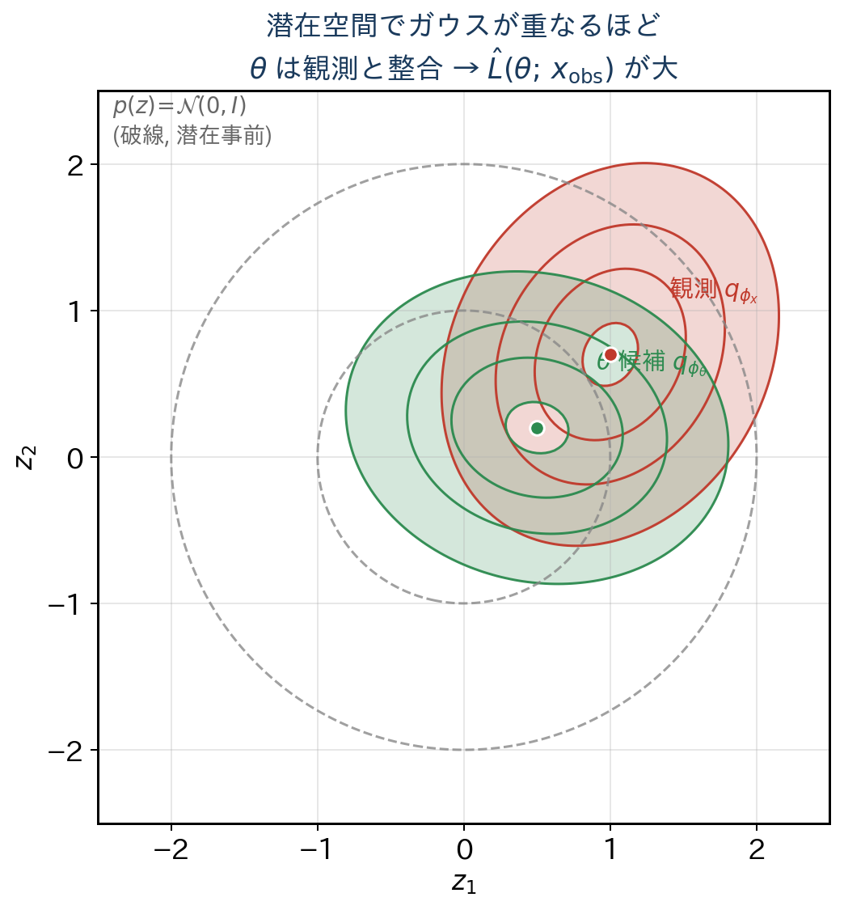
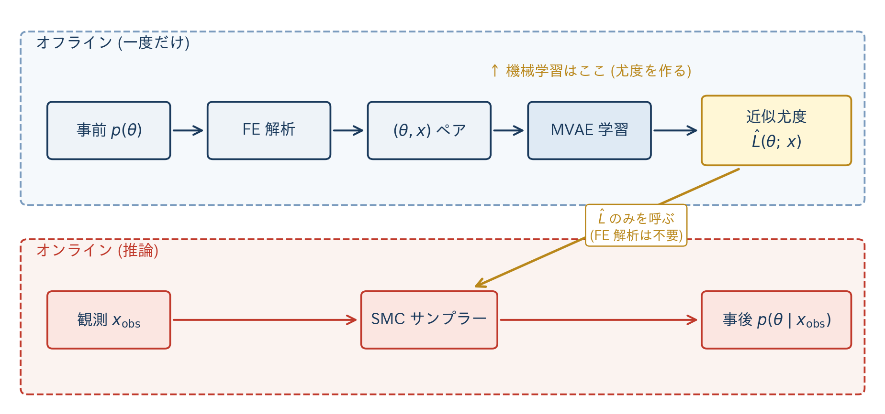
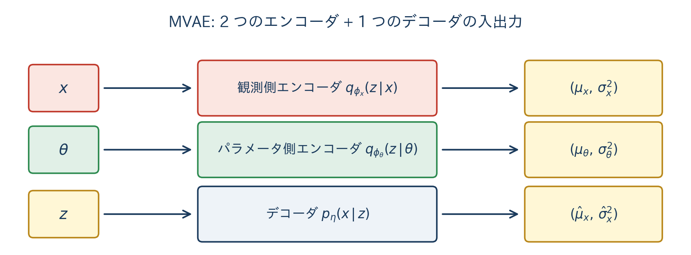

<!-- _class: title -->

# 工学逆問題における不確実性定量化のための
# 潜在空間ベイズ推論フレームワーク構築

<br>

A Latent-Space Bayesian Inference Framework for
Uncertainty Quantification in Engineering Inverse Problems

<br><br>

指導教員　村上健太 准教授
03-250919　笠井優作

---

# 1. 研究の背景 — 工学逆問題と不確実性定量化

**工学では「観測データからモデルパラメータを推定」する逆問題が遍在**

- 構造物の剛性・減衰の同定、材料定数・損傷度の推定、流体・熱輸送パラメータの推定
- 診断・リスク評価・意思決定には、推定の **不確実性定量化** が不可欠

**点推定では不十分な理由**:

- **観測情報の制約**による **等価性（識別不能性）** — 異なるパラメータ配分が同じ応答を出すケースがあり、点推定は **複数の解候補を見落とす**
- 信頼区間・分散など **「どの程度信頼できるか」** が出ない

**ベイズ推論** は事後分布として不確実性を直接与える:

$$
p(\theta \mid x_\mathrm{obs}) \;\propto\; \underbrace{L(\theta;\,x_\mathrm{obs})}_{\text{尤度}} \cdot \underbrace{p(\theta)}_{\text{事前}}
$$

<!--
SPEAKER: 30秒。工学逆問題 → 不確実性定量化の必要性 → 等価性の話 → ベイズで事後分布。
-->

---

# 2. 本研究の目的 — フレームワーク構築

**ベイズ推論の実用上の壁**: 高コストなシミュレータ呼び出し

→ これを回避できる **潜在空間ベイズ推論 (LSBI)** が近年提案されている (Yaoyama 2026 ほか)

**しかし**: 既存実装は特定の手法構成（MVAE + SMC など）に **固定** されており、他手法との比較や差し替えが難しい

<br>

**本研究の目的**:

LSBI を起点に、**各構成要素を後から差し替え可能** とした推論フレームワークを構築する

- 尤度モデル・サンプラー・MCMC カーネルなどを **共通インターフェース** で抽象化
- 「**どの手法がどの問題に最適か**」を共通ベンチマーク上で **横断比較** できる土台を作る

<!--
SPEAKER: 25秒。「シミュレータの壁」「既存実装が固定」「差し替え可能なフレームワーク」の3点を明確に。
-->

---

# 3. 潜在空間ベイズ推論 — 定式化



ベイズの定理より:

$$
p(\theta \mid x_\mathrm{obs}) \;\propto\; L(\theta;\, x_\mathrm{obs})\, p(\theta) \tag{1}
$$

**低次元潜在変数 $z$ を介して尤度を近似** する。観測側エンコーダ $q_{\phi_x}(z \mid x_\mathrm{obs})$、パラメータ側エンコーダ $q_{\phi_\theta}(z \mid \theta)$、潜在事前 $p(z) = \mathcal{N}(0, I)$ を **全てガウス** として構成すれば、

$$
\hat{L}(\theta;\, x_\mathrm{obs}) \;=\; \int \frac{q_{\phi_x}(z \mid x_\mathrm{obs})\, q_{\phi_\theta}(z \mid \theta)}{p(z)}\, dz \tag{2}
$$

は **閉形式で評価可能** となる。

<!--
SPEAKER: 50秒。(1) → 低次元潜在を介して尤度を近似 → ガウスにすれば(2)が閉形式、と式を順に指で追う。右図は2つのエンコーダ分布が潜在空間で重なるイメージ。
-->

---

# 4. 全体像 — オフライン/オンラインの 2 段構成



- **オフライン**: 事前から $(\theta, x)$ サンプル → MVAE 学習 → 近似尤度 $\hat{L}$ 構築
- **オンライン**: SMC が $\hat{L}$ のみを呼び事後分布から粒子をサンプリング → 推論ループで **シミュレータを呼ばない**

<!--
SPEAKER: 30秒。図でオフライン (MVAE学習) → オンライン (SMC) を流す。「FEを推論時に呼ばない」を強調。
-->

---

# 5. Multimodal Variational Autoencoder (MVAE) の学習

**MVAE = 2 つのエンコーダ + 1 つのデコーダ** からなる確率モデル



- **学習**: 双方向 KL + 再構成損失 → 2 エンコーダ出力が **同じ潜在空間** で対応するよう整列
- **学習後の使い道**: 学習済みエンコーダ $q_{\phi_x}, q_{\phi_\theta}$ が、そのまま **式 (2) の被積分関数として近似尤度 $\hat{L}$ の計算に投入される**
- 観測を一度エンコードしておけば、SMC 中は **パラメータ側エンコーダの順伝播** だけで尤度評価が完了

<!--
SPEAKER: 30秒。図で2エンコーダ+1デコーダの入出力を示し、「学習後に2つのエンコーダがそのまま式(2)に入る」という橋渡しを明確に。
-->

---

# 6. フレームワーク実装① — 概念的役割への分離

文献 1) で採用されている具体手法を、**共通の概念的役割** に分離して整理:

| 概念的役割     | 現実装                  | 差し替え候補                       |
| -------------- | ----------------------- | ---------------------------------- |
| 尤度モデル     | MVAE 潜在尤度           | Normalizing Flow / 拡散モデル / 直接尤度 |
| サンプラー     | 焼きなまし型 SMC        | HMC / NUTS / Nested Sampling       |
| MCMC カーネル  | RW-Metropolis           | MALA / HMC ステップ                |
| 提案分布       | Ching & Chen (2007)     | 適応 MH / 学習済み提案             |
| 事前分布       | HierarchicalPrior (DAG) | 任意の確率変数 DAG                 |

**ねらい**: 「どの手法を採用するか」と「上位ロジック」を分離し、後から **差し替え** できる構造にする

<!--
SPEAKER: 30秒。表を指でなぞる。「現実装の列はあくまで一例」「右の列の差し替えが本研究の主目的」を強調。
-->

---

# 7. フレームワーク実装② — Protocol によるインターフェース

各概念的役割を Python の `Protocol` で **インターフェースのみ宣言**:

```python
class LikelihoodProtocol(Protocol):
    def __call__(self, theta: Theta) -> LP: ...

class KernelProtocol(Protocol):
    def __call__(
        self, particles: Particles, q: float,
        prior: PriorProtocol, likelihood: LikelihoodProtocol,
    ) -> tuple[Pop, LP, Mask]: ...
```

**図 1** 代表的な Protocol 定義（抜粋）

- 具体実装は Protocol にのみ依存し、上位ロジックは具体クラスを知らない
- 新しい尤度モデル・サンプラーを **継承なしに** 持ち込める（構造的部分型）

→ 設計思想: 「**どの手法がどの問題に最適か**」を共通ベンチマーク上で **横断比較** できる構成

<!--
SPEAKER: 30秒。コードを軽く読み下し、「シグネチャだけで定義」「継承なしで差し替え」を口頭で。
-->

---

# 8. 検証 — 4自由度せん断建物

**ベンチマーク** (Yaoyama 2026 と同じ):

- 4 自由度せん断建物の **層剛性同定問題**
- 観測は **屋上 FRF** (1024 点) のみ
- $\theta_i \in [0.33, 3.00]$、真値 $\theta=(1,1,1,1)$
- 観測の制約から **真値以外に 3 つの等価解** が存在することが既知

**学習設定**:
- 訓練データ: 事前分布から生成した $10^5$ サンプル
- MVAE: 潜在次元 8、早期終了付き

→ 多峰性が現れる古典的ベンチマークでフレームワークの動作確認

<!--
SPEAKER: 20秒。Slide 1 で触れた「等価性」の具体例として 3 等価解を強調。
-->

---

# 9. 検証 — 結果


**SMC**: 粒子数 2000、GPU 上で実行

**事後分布散布図**（右図）:
- **真値** $(1,1,1,1)$ に対応する集中モード
- **既知の等価解 3 点** にも別モードが立つ

→ 観測の制約に由来する **多峰性を本フレームワークが正しく追跡** できることを確認

→ Slide 1 で挙げた **等価性** を「単一解に押し込めず、事後分布で正直に表現」できている

<!--
SPEAKER: 35秒。各モード(真値+3等価解)を散布図上で指し、背景の等価性とつなげて締める。
-->

---

# 10. 課題と今後

**現状の限界**:
- 検証は 4DOF せん断建物のみ
- 他の尤度モデル・サンプラーは未実装、横断比較はこれから

**今後**:

🎯 **尤度モデル拡張を最優先課題** とする
- **Normalizing Flow / 拡散モデル** 等を実装
- 同一ベンチマーク上で **横断比較**

→ 複雑系へ適用を広げ、**汎用ライブラリへ発展** させる

<br>

<center>

**ご清聴ありがとうございました**

</center>

<!--
SPEAKER: 15秒。「尤度モデル拡張」「横断比較」「汎用ライブラリ」で締める。
-->
