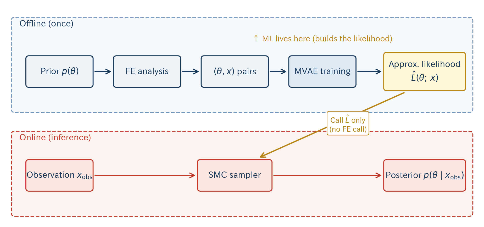
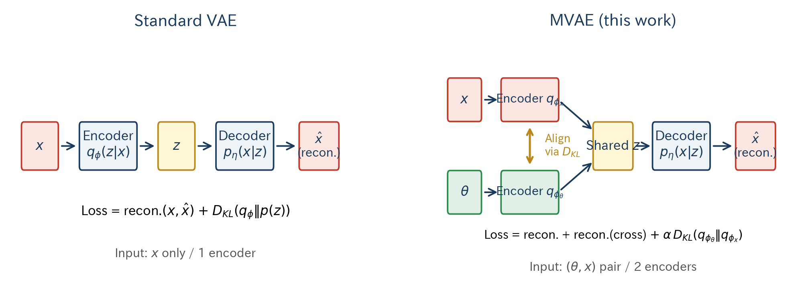
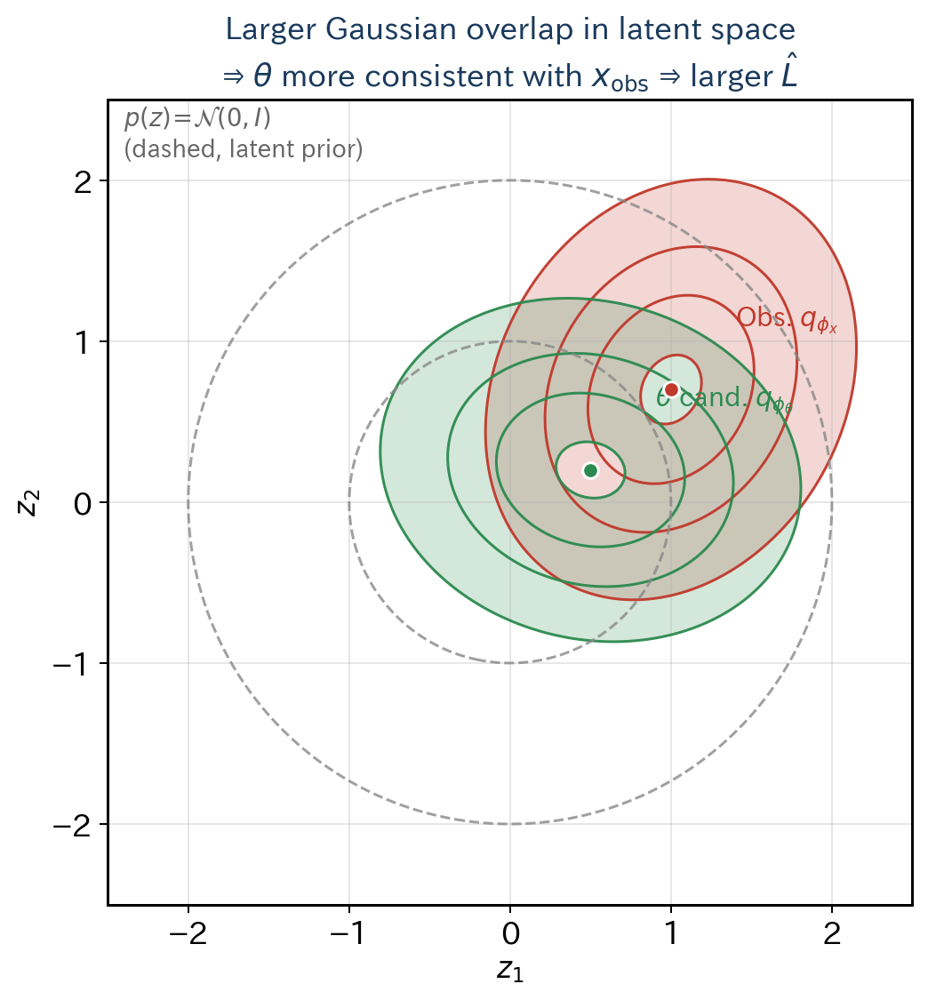
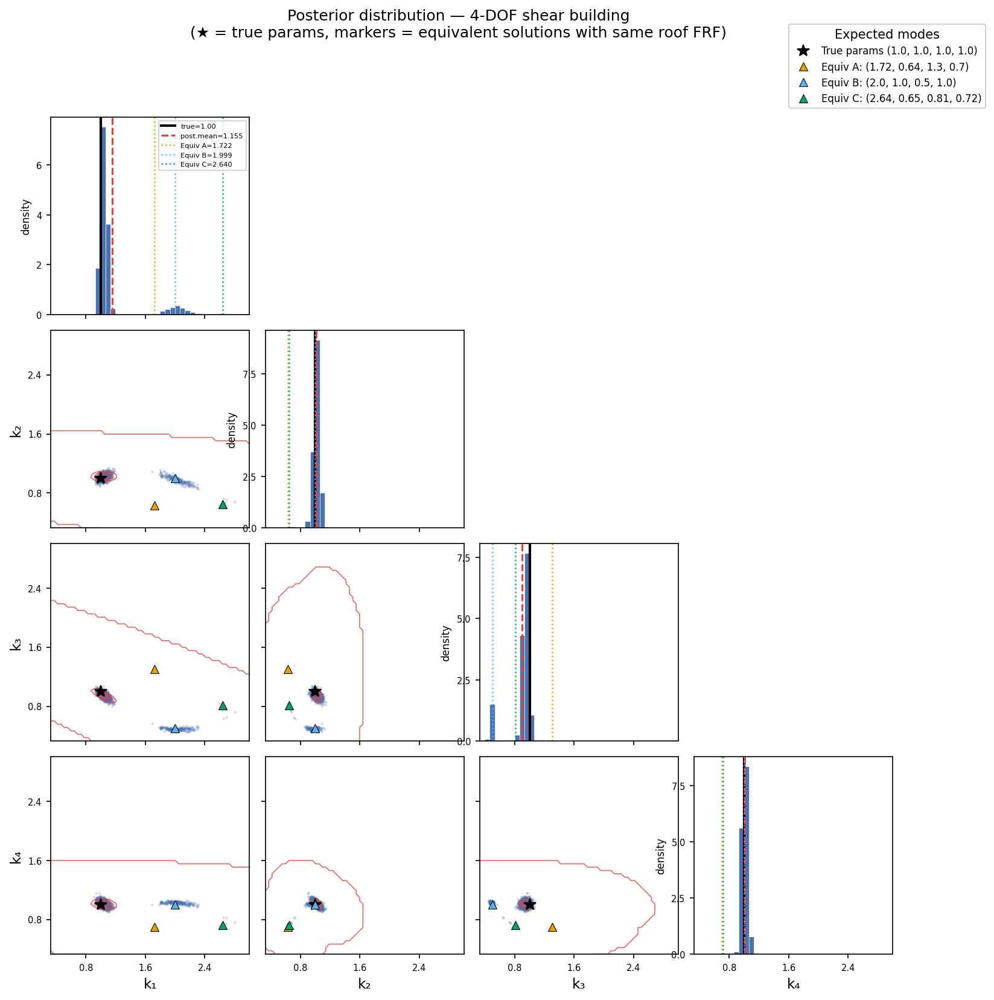

<!-- _class: title -->

# A Library Implementation of Latent-Space Bayesian Inference + MVAE + SMC

## — Bayesian FE Model Updating of Buildings from Observed Vibration as a Test Case —

 

Implementation and inference infrastructure for Yaoyama et al. (2026, NED)

  

**Presenter**: (name)
**Affiliation**: (affiliation)
**Date**: 2026-XX-XX

---

# Background — What Bayesian inference offers

- Accurate seismic response prediction requires high-fidelity FE models
- But **design-time FEM ≠ as-built building** (aging, construction tolerances, non-structural contributions, …)
- We want to **Bayesian-update** stiffness parameters $\theta$ from observed vibration $x_\mathrm{obs}$

**Bayes' theorem**:

$$
p(\theta \mid x_\mathrm{obs}) \;\propto\; \underbrace{L(\theta;\, x_\mathrm{obs})}_{\text{likelihood}} \; \cdot \; \underbrace{p(\theta)}_{\text{prior}}
$$

→ **If the likelihood $L$ can be evaluated, the posterior follows (via MCMC etc.)**

But in this problem, evaluating $L$ is itself the bottleneck — see next slide.

<!--
SPEAKER: 50s. Anchor on Bayes' theorem; "if we have the likelihood, the posterior is in reach". The formula sets up the obstacle.
-->

---

# Goal and challenges

**Goal**: Efficiently estimate the **posterior** $p(\theta \mid x_\mathrm{obs})$ of stiffness parameters $\theta$ from observed FRF $x_\mathrm{obs}$

**Benchmark (later)**: the same 4-DOF shear building as in the paper — can we recover the true $\theta = (1,1,1,1)$ from roof FRF only?

**Three challenges**:

|     | Challenge                  | Detail                                                                  |
| --- | -------------------------- | ----------------------------------------------------------------------- |
| ①   | **High-dim observation**   | FRF has 1024 points → defining $p(x_\mathrm{obs}\mid\theta)$ is hard    |
| ②   | **Expensive simulator**    | Standard MCMC calls FE analysis $10^5$+ times — infeasible              |
| ③   | **Multi-modality**         | Multiple $\theta$ reproduce the same roof response (equivalent solutions) |

<!--
SPEAKER: 25s. Mention the benchmark briefly so it isn't a surprise later.
-->

---

# Proposed method — Overview

**Offline**: MVAE replaces the costly likelihood with a low-dim approximation $\hat{L}$ (ML's role) /
**Online**: SMC infers the posterior using $\hat{L}$ only (no FE calls)

<!--
SPEAKER: 30s. Separate the ML role (offline, builds the likelihood) from the inference role (online, SMC). Emphasize "no FE calls during inference".
-->

---

# Step 2: MVAE — comparison with a standard VAE

- VAE: input $x$ only, 1 encoder / MVAE: $(\theta, x)$ pair, **2 encoders aligned via KL**
- After training, $\theta$ and $x_\mathrm{obs}$ become **comparable in the same latent space**

<!--
SPEAKER: 40s. Walk left-to-right across both panels. Highlight that "input", "# encoders", and the KL term in the loss are the three things that differ.
-->

---

# Step 3a: Latent-space likelihood — derivation

True likelihood (intractable directly):

$$L(\theta;\, x_\mathrm{obs}) = \int p(x_\mathrm{obs}\mid z)\, p(z\mid \theta)\, dz$$

MVAE approximation (two encoders + latent prior $p(z)$):

$$\hat{L}(\theta;\, x_\mathrm{obs}) = \int \frac{q_{\phi_x}(z\mid x_\mathrm{obs})\, q_{\phi_\theta}(z\mid \theta)}{p(z)}\, dz$$

All terms are **Gaussian** → **closed form via completing the square**
→ **Likelihood evaluated by encoder passes only**, no FE call

<!--
SPEAKER: 35s. Walk through the three lines. The right panel makes "overlap = likelihood" tangible.
-->

---

# Step 3b: SMC — annealing + weights + MCMC

**Annealing**: inverse temperature $\beta_t \in [0,1]$ stepped from 0 to 1 via intermediate PDFs

$$
p_t(\theta) = c^{-1}\, \hat{L}(\theta;\,x_\mathrm{obs})^{\beta_t - \beta_{t-1}}\, p_{t-1}(\theta), \quad
w^{(n)}_t(\beta) = \hat{L}\bigl(\theta_{t-1}^{(n)};\,x_\mathrm{obs}\bigr)^{\beta-\beta_{t-1}}
$$

→ Next $\beta_t$ found by **bisection** to keep ESS $\geq \gamma N$, then resample

**MCMC move**: Gaussian transition kernel $K(\theta, \cdot) = \mathcal{N}\!\left(\cdot \mid \theta,\, \Sigma_t\right)$, covariance from Ching & Chen (2007)

$$
\Sigma_t = \frac{b^2}{S_t}\sum_{n} w_t^{(n)}(\theta_t^{(n)}-\bar\theta_t)(\theta_t^{(n)}-\bar\theta_t)^\top, \qquad \eta = \min\!\left\{1,\; \frac{p_t(\theta^*)}{p_t(\theta)}\right\}
$$

Particles evolve independently → **GPU-friendly parallelism**, annealing → **robust to multi-modality**

<!--
SPEAKER: 35s. Split into three blocks: anneal+weight, kernel+covariance, acceptance. Don't read every symbol.
-->

---

# Benchmark — 4-DOF shear building

**Setting** (same as the paper):

- 4-story shear model: **each floor displaces only in one horizontal direction** (lumped mass / spring / damper)
- Equal floor masses $m$, story stiffness $k_i = \theta_i k$  ($\theta_i \in [0.33, 3.00]$)
- Damping: Rayleigh (damping ratio 0.02 at 1 Hz and 30 Hz)
- Observation: **base excitation + roof FRF only**, 1024 points, additive noise
- True value: $\theta = (1,1,1,1)$; prior: $\mathcal{U}([0.33, 3.00])$

**Equation of motion**:

$$
M \ddot{\mathbf{u}} \;+\; C(\theta) \dot{\mathbf{u}} \;+\; K(\theta)\, \mathbf{u} \;=\; -M\,\boldsymbol{\iota}\, \ddot{u}_g
\qquad (\mathbf{u}\in\mathbb{R}^4: \text{horizontal floor disp.})
$$

→ Transformed to frequency domain; the observable is $\log|H(f)|$ of roof absolute acceleration

<!--
SPEAKER: 25s. Equal masses / Rayleigh damping / roof-only observation as three quick points.
-->

---

# Results — Posterior and runtime

Posterior:
- Main mode concentrates at true $(1,1,1,1)$
- Equivalent solutions A/B/C also recovered as separate modes

Runtime (paper, Table 2):

|                          | Wall-clock | MMD       |
| ------------------------ | ---------- | --------- |
| **SMC** ($N_s\!=\!2000$) | **0.8 s**  | **0.051** |
| NUTS                     | 1782 s     | 0.629     |

→ ≈ **2200× speed-up** via GPU parallelism; SMC also wins on MMD

<!--
SPEAKER: 25s. Three messages: true recovery, equivalent modes, order-of-magnitude speed-up.
-->

---

# What I worked on — Extensible re-implementation

The method itself is from the existing paper (Yaoyama et al. 2026). **My work is a re-implementation that preserves the current method but is structured for future replacement/extension.**

| Module          | Current content              | Extracted Protocol (replaceable)      |
| --------------- | ---------------------------- | ------------------------------------- |
| Sampler         | SMC                          | `class SMC` → HMC/NUTS/NS             |
| MCMC kernel     | RW-Metropolis                | `KernelProtocol` → MALA/HMC           |
| Proposal        | Ching & Chen (2007)          | `ProposalProtocol` → adaptive MH etc. |
| Likelihood      | MVAE latent likelihood       | `LikelihoodProtocol` → VAE/NF etc.    |
| Prior           | HierarchicalPrior (DAG)      | `PriorProtocol` → any random variable |

**Other improvements**: module dependency cleanup / `uv` management & package publishing / documentation

<!--
SPEAKER: 40s. Emphasize "I". The protocols are listed concretely; details go to Q&A.
-->

---

# Summary and future work

**What I did**:
- Re-implemented LSBI-SMC in PyTorch in an **extensible form**; verified on the 4-DOF benchmark
- Pulled each component out behind a **Protocol** so they can be swapped later

**Future work (library extensions)**:
- Comparison with other samplers (NUTS / Nested Sampling)
- Comparison with non-MVAE likelihoods (standard VAE / Normalizing Flow / direct likelihood)
- Additional observation modalities (multiple sensors, acceleration + displacement)
- Scaling to higher DOF / nonlinear response
- Public benchmark suite (additional verification problems beyond the 4-DOF case)

 

**Thank you for your attention.**

<!--
SPEAKER: 30s. Two "did" bullets, five "future" bullets — keep it tempo-driven.
-->
